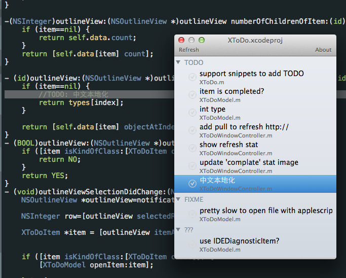
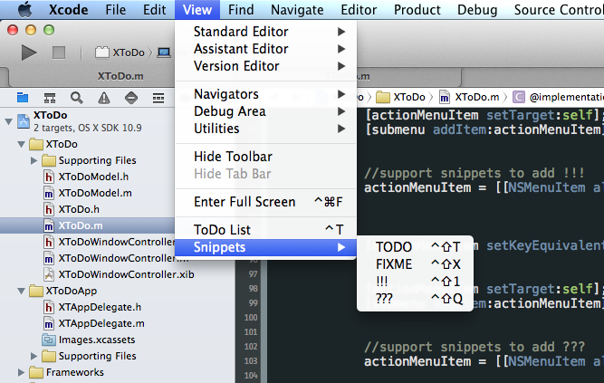

## XToDo -- Xcode plugin
to collect and list the `TODO`,`FIXME`,`???`,`!!!`





### Install
clone this repo Build the project and it's done!

or you can download from [this link](https://www.dropbox.com/s/bgn4x4i9rt7s0uw/XToDo.xcplugin.zip) and move the plugin to path  
 `~/Library/Application Support/Developer/Shared/Xcode/Plug-ins/`  
 then restart Xcode


### Usage

Open any project and use <kbd>ctrl</kbd>+<kbd>t</kbd> to trigger the List Window on/off

### FAQ
#### not work for new Xcode ?
Please run this in your Terminal:  
```
find ~/Library/Application\ Support/Developer/Shared/Xcode/Plug-ins -name Info.plist -maxdepth 3 | xargs -I{} defaults write {} DVTPlugInCompatibilityUUIDs -array-add `defaults read /Applications/Xcode.app/Contents/Info.plist DVTPlugInCompatibilityUUID`
```
and remember to change the Xcode path `/Applications/Xcode.app` if you have a customize Xcode app name or folder like `/Applications/Xcode-beta.app`
